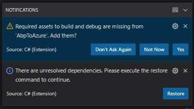
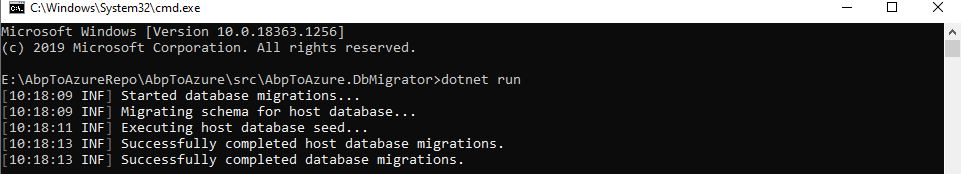
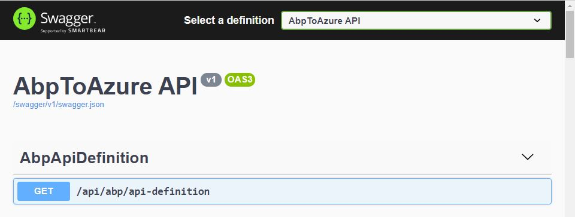
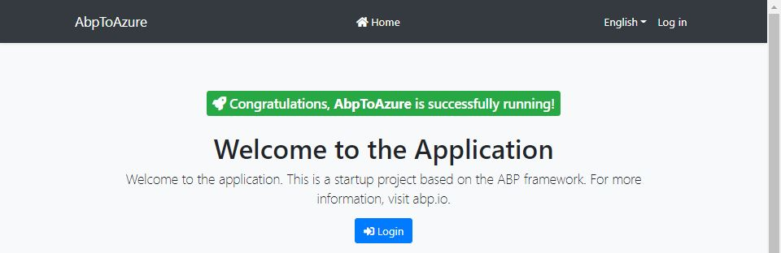

## Part 2: Create a new abp.io application

1. Check your dotnet version. Should be at least* 5.0.x.

   ````bash
   dotnet --version
   ````

2. Install or update first the [ABP CLI](https://docs.abp.io/en/abp/latest/CLI) using a command line window.

   ```bash
   dotnet tool install -g Volo.Abp.Cli || dotnet tool update -g Volo.Abp.Cli
   ```

3. Open a command prompt in the *GitHub repository folder* and create a *new abp Blazor* solution with the command below.

   ```bash
   abp new YourAppName -u blazor
   ```

4. Rename the *aspnet-core* folder to [YourAppName].

5. Open the abp application in VsCode. VsCode will show 2 notifications (if not, hit CTRL+SHIFT+P Restart OmniSharp).

   

6. Click **Yes** to add the *required assets to build and debug* your application. Select the **[YourAppName].HttpApi.Host** project in the *Select the project to launch* dropdown.

7. Click on the **Restore** button to restore the *unresolved dependencies*.

8. Replace the content of *launch.json* file with [this](https://github.com/bartvanhoey/AbpToAzureRepo/blob/gh-pages/AbpToAzure/.vscode/launch.json). Search and Replace [AbpToAzure] with [YourAppName].

9. Replace the content of *tasks.json* file with [this](https://github.com/bartvanhoey/AbpToAzureRepo/blob/gh-pages/AbpToAzure/.vscode/tasks.json). Search and Replace [AbpToAzure] with [YourAppName].

10. Open a command prompt in the [YourAppName].DbMigrator project and enter the `dotnet run` command to apply the database migrations.

    

11. Open a command prompt in the [YourAppName].HttpApi.Host project enter the `dotnet run` command to run the API project.

12. Navigate to the *applicationUrl* specified in the *launchSettings.json* file of the [YourAppName].HttpApi.Host project. You should get the SwaggerUI window.

    

13. Open a command prompt in the [YourAppName].Blazor folder and enter the command below to run the Blazor project.
  
    ```bash
    dotnet run
    ```

14. Navigate to the *applicationUrl* specified in the *launchSettings.json* file of the [YourAppName].Blazor project. You should get the ABP.IO Welcome window.

    

15. Stop both the API and the Blazor project by pressing `CTRL+C`.

16. Open a command prompt in the root folder of your project and add, commit and push all your changes to your GitHub repository.

    ```bash
    git add .
    git commit -m InitialCommit
    git push
    ```

[Previous](Tutorial/../../Part1/Part1.md) | [Next](Tutorial/../../Part3/Part3.md)