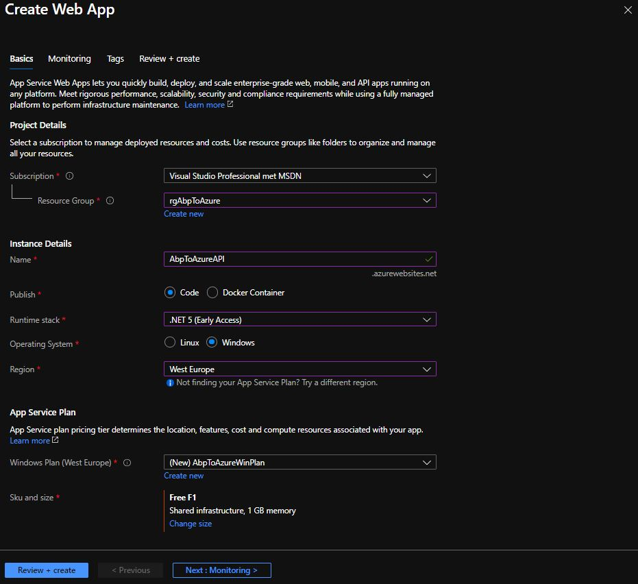

## Part 5: Create Web App in Azure Portal to deploy [YourAppName].HttpApi.Host project

1. Login into the [Azure Portal](https://portal.azure.com/#home).

2. Click on **Create a resource**.

3. Search for *Web App* in the *Search the Marketplace* input field.

4. Click the **Create** button in the *Web App* window.

5. Select *rg[YourAppName]* in the *Resource Group* dropdown.

6. Enter *[YourAppName]API* in the *Name* input field.

7. Select *.NET 5 (Early Access)* in the *Runtime stack* dropdown.

8. Select *Windows* as *Operating System*.

9. Select the same *Region* as in the SQL server you created in Part 3.

10. Click on **Create new** in the Windows Plan. Name it *[YourAppName]WinPlan*.

11. Click **Change size** in *Sku and size*. Go for the *Dev/Test Free F1* version and click the **Apply** button.

12. Click the **Review + create** button. Click the **Create** button next.
  
    

13. Click on **Go to resource** when the Web App has been created.

14. Click on **Configuration** in the left menu and click + **+ New application setting** in the *Application settings* window.

15. Enter *ASPNETCORE_ENVIRONMENT* in the *Name* field and *Staging* in the *Value* field. Click the **OK**, **Save** and **Continue** buttons.Close the *Configuration* window.

16. Copy the URL of the Web App.

[https://[YourAppName]api.azurewebsites.net](https://[YourAppName]api.azurewebsites.net)

[Home](./../../README.md) | [Previous](Tutorial/../../Part4/Part4.md) | [Next](Tutorial/../../Part6/Part6.md)
