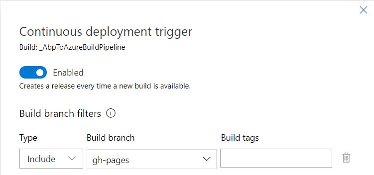
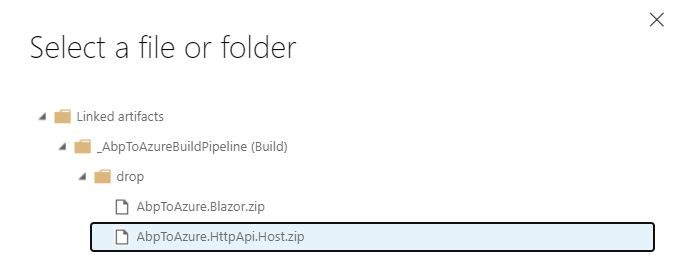
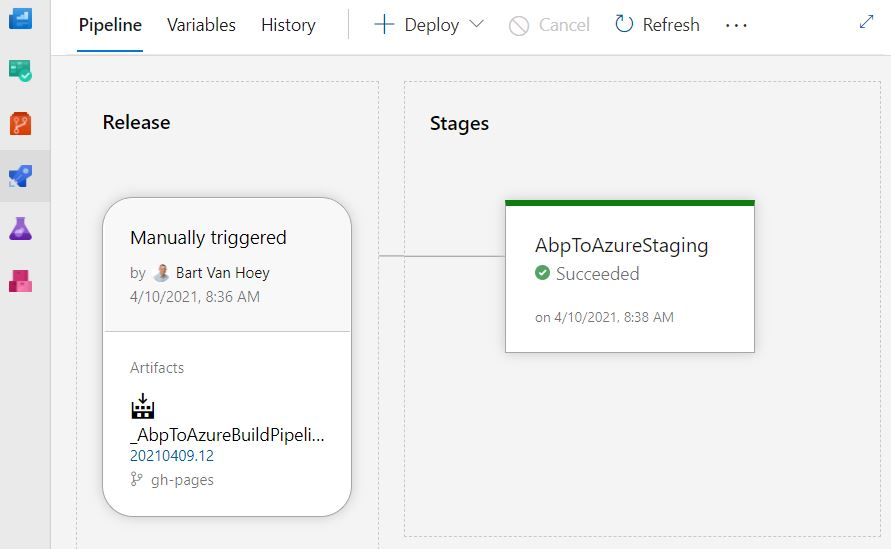
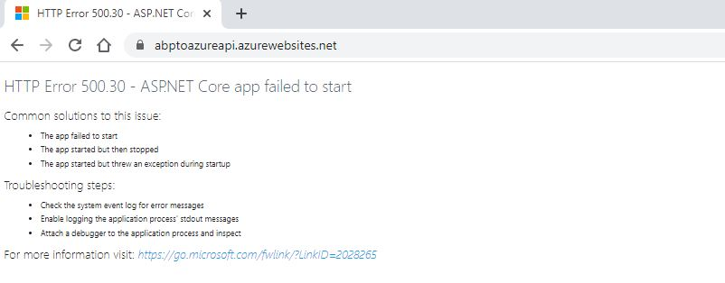

## Part 6: Create Release pipeline in AzureDevops and Deploy HttpApi.Host project

1. Sign in into [Azure DevOps](https://azure.microsoft.com/en-us/services/devops/").

2. Click on [YourAppName]Proj and click on **Releases** in the *Pipelines* menu.

3. Click on the **New pipeline** button in the *No release pipelines found* window.

4. Select *Azure App Service deployment* and click the **Apply** button.

5. Enter *[YourAppName]staging* in the *Stage name* field in the *Stage* window. Close window.

6. Click **+ Add an artifact**.

7. Select the **Build** icon as *Source type* in the *Add an artifact* window.

8. Select *[YourAppName]BuildPipeline* in the *Source (build pipeline)* dropdown and click the **Add** button.

9. Click on the **Continuous deployment trigger (thunderbolt icon)**.

10. Set the toggle to **Enabled** in the the *Continuous deployment trigger* window.

11. Click **+ Add** in *No filters added*. Select **Include** in the *Type* dropdown.
    Select your branch in the *Build* branch dropdown and close the window
    

12. Click on **the little red circle with the exclamation mark** in the *Tasks* tab menu.

13. Select your subscription in the *Azure subscription* dropdown.

14. Click **Authorize** and enter your credentials in the next screens.  

15. After Authorization, select the **[YourAppName]API** in the *App service name* dropdown.

16. Click on the **Deploy Azure App Service** task.

17. Select **[YourAppName].HttpApi.Host.zip** in the *Package or folder* input field.
   

18. Click on the **Save** icon in the top menu and click **OK**.

19. Click **Create release** in the top menu. Click **Create** to create a release.

20. Click on the **Pipeline** tab and wait until the Deployment succeeds.
   

21. Open a browser and navigate to the URL of your Web App.

    ```html
    https://[YourAppName]api.azurewebsites.net
    ```

22. It's possible that you receive the error *HTTP Error 500.30 - ANCM In-Process Start Failure*
    

23. The Deployment succeeded, but the API project is still having issues. We will fix them in the next part.

[Home](./../../README.md) | [Previous](Tutorial/../../Part5/Part5.md) | [Next](Tutorial/../../Part7/Part7.md)
