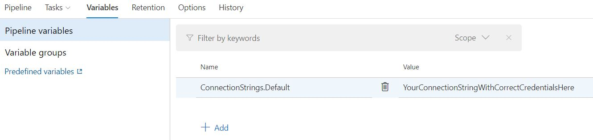

## Part 7: Release pipeline finished, API deployment succeeded. Web App not working! How to fix the issues?

  1. When the Release pipeline has finished and the Deployment of the API succeeded, open a browser window and navigate to the URL of your Web App.
  
      ```html
      https://[YourAppName]api.azurewebsites.net
      ```

  2. It's possible that you receive the error *HTTP Error 500.30 - ANCM In-Process Start Failure*.
  
      

  3. Open the *Debug Console/CMD* in the *Kudu* window by navigating to *[YourAppName]api.scm.azurewebsites.net*.

      ```html
      https://[YourAppName]api.scm.azurewebsites.net
      ```

  4. Run the *dir* command to heck if [YourAppName].HttpApi.Host files have been deployed in the *home\site\wwwroot* folder.

      ```bash
      dir
      ```

  5. Check the dotnet version of the Azure Web App. Should be 5.0.x.

      ```bash
      dotnet --version
      ```

      

  6. To solve error *HTTP Error 500.30 - ANCM In-Process Start Failure* update the [YourAppName].HttpApi.Host.csproj file.

      ```bash
        <PropertyGroup>
          <TargetFramework>net5.0</TargetFramework>
          // add the line below
          <AspNetCoreHostingModel>OutOfProcess</AspNetCoreHostingModel>
          <RootNamespace>AbpToAzure</RootNamespace>
          <PreserveCompilationReferences>true</PreserveCompilationReferences>
          <UserSecretsId>AbpToAzure-4681b4fd-151f-4221-84a4-929d86723e4c</UserSecretsId>
        </PropertyGroup>
      ```
  
  7. Open a command prompt in the root folder of your project and Add, Commit and Push all your changes to your GitHub repository.

      ```bash
      git add .
      git commit -m OutOfProcess
      git push
      ```

  8. Pushing to your GitHub repository will trigger a *new Build* as *Continuous Integration* is enabled in the Build pipeline.

  9. When the Build finishes, a new Release will start. Wait until the Release has finished and the Deployment Succeeded.
  
  10. Navigate to the URL of the Web App. You probably see the error *An error occurred while starting the application.*.

      
  
  11. Open the *Debug Console/CMD* in the *Kudu* window by navigating to [YourAppName]api.scm.azurewebsites.net.

      ```html
      https://[YourAppName]api.scm.azurewebsites.net
      ```

  12. Try to invoke an *error description* by entering the command below in the *home/site/wwwroot* folder of the *Debug Console*.

      ```html
      dotnet [YourAppName].HttpApi.Host.dll
      ```

  13. If you receive no Error description. Go to *Program.cs* in the *[YourAppName].HttpApi.Host* project and comment out the *if debug statements*.

      ```csharp public class Program
      {
          public static int Main(string[] args)
          {
              Log.Logger = new LoggerConfiguration()

      // #if DEBUG
                      .MinimumLevel.Debug()
      // #else
                      .MinimumLevel.Information()
      // #endif
                      .MinimumLevel.Override("Microsoft", LogEventLevel.Information)
                      .MinimumLevel.Override("Microsoft.EntityFrameworkCore", LogEventLevel.Warning)
                      .Enrich.FromLogContext()
                      .WriteTo.Async(c => c.File("Logs/logs.txt"))
      // #if DEBUG
                      .WriteTo.Async(c => c.Console())
      // #endif
                      .CreateLogger();
      // other code here ...
      ```

  14. Add, Commit and Push all your changes to your GitHub repository.

      ```html
      git add .
      git commit -m CommentOutDebugStatements
      git push
      ```

  15. Wait until the new Build and new Release have finished and the Deployment has succeeded.

  16. Navigate to the URL of the Web App. You should see the same error *An error occurred while starting the application.* again.
  
  17. Open the *Debug Console* in the *Kudu* window by navigating to [YourAppName]api.scm.azurewebsites.net.
  
      ```html
      https://[YourAppName]api.scm.azurewebsites.net
      ```
  
  18. Enter the command below in the *home/site/wwwroot* folder of the *Debug Console* to start the application.
      You should see the detailed error description. The file *tempkey.rsa* is missing.
  
      ```html
      dotnet [YourAppName].HttpApi.Host.dll
      ```

      

  19. Add the section below to the *[YourAppName].HttpApi.Host.csproj* file to copy the *missing tempkey.jwk* file to the output directory.

      ```html
      <ItemGroup>
          <None Update="tempkey.jwk">
            <CopyToOutputDirectory>PreserveNewest</CopyToOutputDirectory>
          </None>
        </ItemGroup>
      ```

  20. Add, Commit and Push all your changes to your GitHub repository.

      ```html
      git add .
      git commit -m CopyTempkeyJwkToOutputDirectory
      git push
      ```

  21. Wait until the new Build and Release pipelines have finished and the Deployment has succeeded.

  22. Navigate to the URL of the Web App to see if the error is gone.
  
  23. It's possible that you get another error: *This page isn’t working*.
  24. Open the *Debug Console* in the *Kudu* window by navigating to *[YourAppName]api.scm.azurewebsites.net*.

      ```html
      https://[YourAppName]api.scm.azurewebsites.net
      ```

  25. Enter the command below in the *wwwroot* folder of the *Debug Console* to get a more specific error description.
  
      ```html
      dotnet [YourAppName].HttpApi.Host.dll
      ```

  26. Probably you receive the error description below.
  
      

  27. Navigate to the *Azure Portal* and go to the *[YourAppName]server*.

  28. Click on **Firewalls and virtual networks** in the left menu.
  29. Select **Yes** in the *Allow Azure services and resources to access this server* toggle.
  30. Click the **Save** button. Click **OK** in the *Successfully updated server firewall rules* window. Close the window .
  31. Navigate again to the URL of the Web App and Refresh the page. The login will fail for the specified user because of incorrect credentials in the appsettings.Staging.json file.

      

   We will need to tell the system to use the correct credentials for the placeholders {YourUserName} and {YourPassword} in the connection string of the appsettings.Staging.json file.
  32. Go to your AzureDevOps project, Pipelines, Releases. Click the **Edit** button.
  33. Click on the **1 job, 1 task** link and click on the **Deploy Azure App Service** task.
  34. Enter _**/appsettings.Staging.json_ in the *JSON variable substitution* input in *File Transforms & Variable Substitution Options*
      
  35. Click on the **Variables** tab and add the variable ConnectionStrings.Default as in the image below
      
  36. Click on **Create release** to create a new release. When the release has finished navigate to the your Web App Url.
  37. Your *[YourAppName].HttpApi.Host* project should now **be up and running** and the *Swagger* page is served by your Web App in Azure.
    

[Home](./../../README.md) | [Previous](Tutorial/../../Part6/Part6.md) | [Next](Tutorial/../../Part8/Part8.md)
