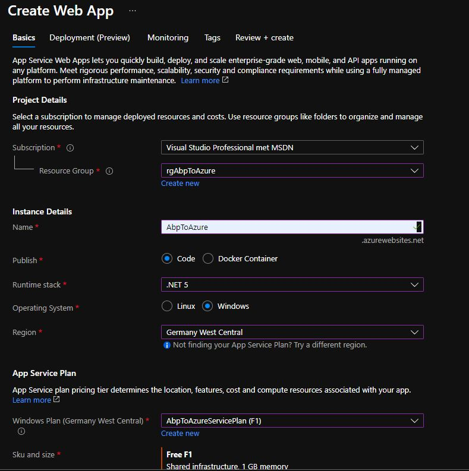

## Part 8: Create a Web App in the Azure Portal to deploy [YourAppName].Blazor project

1. Login into the [Azure Portal](https://portal.azure.com/#home).

2. Click on **Create a resource**.

3. Search for *Web App* in the *Search the Marketplace* input field.

4. Click the **Create** button in the *Web App* window.

5. Select *rg[YourAppName]* in the *Resource Group* dropdown.

6. Enter [YourAppName] in the *Name* input field

7. Select *.NET 5 (Early Access)* in the *Runtime stack* dropdown.

8. Select *Windows* as *Operating System*.

9. Select the same *Region* as in the SQL server you created in Part 3.

10. Select *[YourAppName]WinPlan* in the *Windows Plan* dropdown.

11. Go for the *Dev/Test Free F1* version in the *Sku and size* section.

12. Click the **Review + create** button. Click the **Create** button next.
  
    

13. Click on **Go to resource** when the Web App has been created.

14. Copy the URL of the Blazor Web App for later use

    ```html
    https://[YourAppName].azurewebsites.net
    ```

[Home](./../../README.md) | [Previous](Tutorial/../../Part7/Part7.md) | [Next](Tutorial/../../Part9/Part9.md)