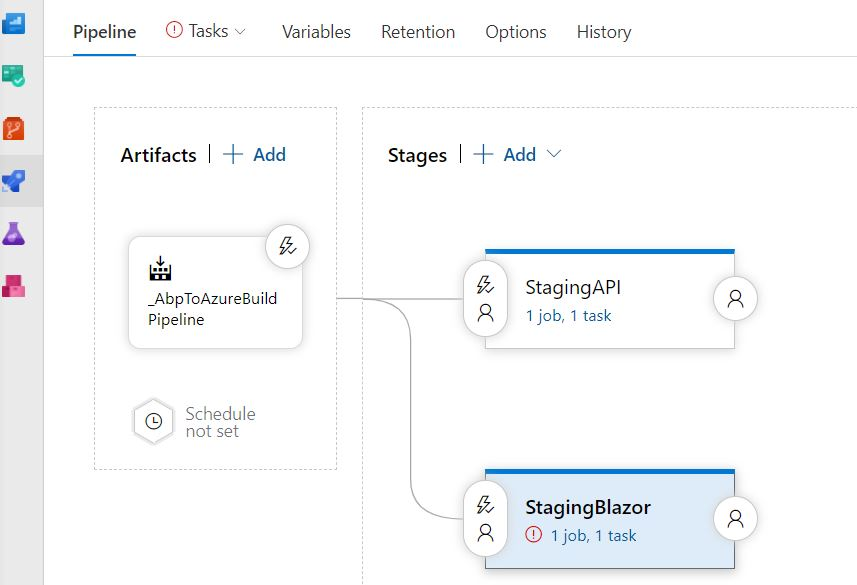

## Part 9: Add extra Stage in the Release pipeline in AzureDevops to deploy [YourAppName].Blazor project

  1. Go to the *Releases* section in [AzureDevOps](href="https://azure.microsoft.com/en-us/services/devops/) and click **Edit**.
  2. Click the **+ Add** link and click **+ New Stage**.
  3. Select *Azure App Service deployment* and click the **Apply** button.
  4. Enter *StagingBlazor* in the *Stage name* input field and close the *Stage* window.

      
  
  5. Click on the **little red circle with the exclamation mark** in the _StagingBlazor_ stage.
  6. Select your _Available Azure Service Connection_ in the *Azure subscription* dropdown.
  7. Select your [YourAppName] Blazor Web App in the *App service name* dropdown.
  8. Click on the **Deploy Azure App Service task**.
  9. Select *[YourAppName].Blazor.zip* in the *Package or folder* input field and click **OK**.

      

  10. Enter ***/appsettings.json* in the *JSON variable substitution* input field.
  11. Click on the **Variables** tab and add the variables *AuthServer.Authority* and *RemoteServices.Default.BaseUrl* as in the image below.

      

  12. Click **Save** in the top menu and click on the **OK** button after.
  13. Click **Create release** in the top menu and click on the **Create** button.
  14. Navigate to the URL of your Blazor Web App after the finishes and open the *Developer Tools (F12)* of your browser.
  15. You probably see the error below in the *Console* window of your browser.

      

  16. As you can see the deployment succeeded, but the Web App is having issues. We will fix them in the next part.

[Home](./../../README.md) | [Previous](Tutorial/../../Part8/Part8.md) | [Next](Tutorial/../../Part10/Part10.md)
